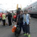

Пересечение озера Байкал от берега до берега на обычной речной байдарке. И далее вдоль берега до Байкало-Ленского заповедника. Всего 340 км. Август — Сентябрь 2011 года. 
[Фотографии](media) |
<a href="/map/?type=hybrid&amp;center=52.81922,107.00964&amp;zoom=8&amp;kml=kml2011" target="_blank">Трек</a>

## Подготовка
Десять дней в устье Селенги, у Байкала, изучал погоду. Ветер дул постоянно, поднимая на байкальской акватории белые барашки, [различимые с крыши](08.jpg?classes=jpic) моего временного дома. Потом короткое затишье, и ветер меняется на противоположный. Моя задача была заранее почувствовать наступление затишья и воспользоваться им.

## От берега до берега
Грёб между берегами 34 км, из них 3 км по устью Селенги от маяка до начала сора. На всё пересечение понадобилось 7 часов — с 12 до 19 местного времени.

## Всего проплыл 340 километров
Стартовал в Улан-Удэ, сплавился по Селенге, пересёк Байкал и плыл вдоль его берега на север, пока не упёрся в Байкало-Ленский заповедник. Пересечение было самым запоминающимся участком, а отрезок вдоль берега — самым неопределённым. Помню, очень громко воскликнул от удивления, когда, [обогнув](snow-mountains.jpg?classes=jpic) очередную выдающуюся скалу, первый раз в жизни увидел [настолько заснеженные горы](29.jpg?classes=jpic) — горы Байкальского хребта на границе Байкало-Ленского заповедника.

## За месяц
Десять дней в устье, десять дней в [бухте Барханы](30.jpg?classes=jpic) или Розовая Перепёлка, названной так за множество красивых камней, десять дней гребли, пять дней в заповеднике, десять дней на обратный путь автостопом. Наконец-то осуществил давнюю задумку проехать автостопом от Иркутска до Москвы. Ехал и вспоминал как три года назад проделал этот же путь на велосипеде. Только тогда понадобилось два месяца, а не десять дней.

## Прохожу пролив Ольхонские Ворота
Ровно месяц после начала пути — дохожу до Ольхона. Почти десять дней изучал погоду в устье Селенги, столько же, присматриваясь, стоял на противоположном берегу Байкала. Так и не дождавшись стабильного затишья или хорошего попутного ветра, начал двигаться рывками, по 10-25 километров в день.

Столько всего произошло за это время! Встречи, события, впечатления — не меньше страницы в дневнике по вечерам заполняю. Вот вчера накрыло *сармой* с дождём, но я уже сидел в спешно установленной палатке, укреплённой абсолютно всеми растяжками и спиной изнутри подпирал наветренную стенку. Ветер продолжался всего минут пятнадцать, а после — полный штиль и ни капли дождя. Непривычно после открытого моря оказаться в заливе — вода совсем рядом, но не шелохнётся, огоньки домов по периметру горят, светится паромная переправа, а вместо ровного горизонта — громада Ольхона.

На каждой стоянке забираюсь на ближнюю сопку, более чем на сотню метров поднимаясь над озером. Вплываю в гроты, качаюсь на волнах, первый раз в жизни искупался в Байкале и хоть вода была ледяная, на пять минут меня хватило. Много-много камня, утёсы, отвесные скалы, но действительно радуюсь, когда вижу зелёную жизнь — деревья и травы. Лиственница, сосна, осины — трудно им жить между горами и морем; берёзы в дальних распадках, чабрец покрывает склоны, почти всегда можно встретить ревень и множество маленьких изящных растеньиц, приспособившихся жить на ветрах и почти без воды. Как готовые букеты, редко разбросаны фиолетовые ромашки, радующие глаз при нелёгкой ходьбе по горным тропинкам.

## Как переплывал Байкал и готовился к этому
Перед пересечением Байкала планировал какое-то время находиться на берегу и наблюдать за погодой. Нужно было всего семь часов стабильного затишья, и я хотел такое затишье спрогнозировать, убедиться в правильности прогноза и использовать его. 8 августа остановился в устье Селенги в трёх километрах от Байкала, как можно ближе к противоположному берегу и без спешки стал наблюдать за небом. Место удачное — могу видеть весь горизонт, потому что нахожусь в центре гигантской долины, окружённой горами. Первое наблюдение — байкальская погода никоим образом не согласуется с иркутской или улан-удэнской, хотя озеро расположено недалеко от этих городов. Второе — ветра постоянны в течение 2-4 дней, но проходит фронт и ветер меняется на противоположный.

Скорый приход самого первого затишья почувствовал интуитивно, но лезть в него не стал; лишь убедившись в как-будто правильном понимании погоды, выждал ещё два дня и в следующее затишье 17 августа переплыл Байкал поперёк, в самом узком месте. Дополнительно подготовил байдарку — чтобы понизить центр тяжести и парусность, как можно больше груза уложил в трюм, к веслу прикрепил страховочную стропу; проверил аккумуляторы, заправил термос. На 33 километра понадобилось ровно 7 часов. Под конец плавания начал набирать силу боковой ветер, последние два часа работал чаще только одним веслом и готовился идти реем, но ветер так и не разогнался. Только ночью он наконец-то взял своё и на следующий день дунул прямо в лицо.

> *Остановился в милой бухте, уже 4 дня жду смену погоды, вчера наконец-то начались дожди и ветер повернул на попутный. За это время облазил все ближние сопки, с высоты 200 метров любуюсь Байкалом. Здесь прекрасно.*

## Ветер
Байкальский ветер живёт своей жизнью. В Иркутске и Улан-Удэ ветер южный, а у меня северный. У них северный, а у меня южный. У них западный и восточный, у меня южный или северный. У них погода уже поменялась, а у меня прежняя. В устье Селенги ветер более-менее понял, переплыв на другой берег, заново его изучаю. Остановился около Бугульдейки, ночью чуть было не улетел в Байкал вместе с мощным ветром с гор. Сарму тоже зацепил, убежал к берегу, жался к нему так, что веслом задевал камни. С утра морось и штиль, а после обеда шквалистый ветер и волна. И так почти каждый день.

## Обратно вернулся автостопом
Давно хотел проехать на попутках от Москвы до Байкала, и вот наконец-то идея осуществилась, только в обратном направлении.
Почти вся дорога была знакома, вспоминал столовые, где останавливался и отдыхал по дороге во Владивосток три года назад, вспоминал и саму дорогу, пейзажи, деревни, города; появилось и новое: развязки, объездные, новые километры автомагистралей.

## Совет переплывателям

Отчалив от восточного берега (стоянка на твёрдой почве в главном русле Селенги возможна не далее маяка 106.28364,52.26804), целиться на точку 106.15440,52.56102. Эта точка севернее Бугульдейки примерно на 8 км. Общая дистанция пересечения остаётся прежней, чуть более 30 км. Здесь гораздо более удобная бухта, закрытая от ветров, есть дрова. За продуктами можно ходить пешком по красивой горной тропе через Малую Бугульдейку, около четырёх часов на путь туда-обратно.

## Перед началом пересечения
Запись в дневнике:
> *Я действительно хочу жить! Полно, ярко, эмоционально, плакать от счастья, проглатывать горе, не замечать трудности. Всегда идти вперёд. Пересечение Байкала для меня — это дверь, за которой оказываются те, кто рискнул и победил. Отдаю себе отчет, что могу не выиграть, но выигрыш от этого становится только ценнее. Понимаю, ледяные волны могут убить, вместо причала могут быть скалы, а вместо ожидаемых тридцати километров может оказаться сто тридцать, и лишь на вторые сутки полуживой выберусь на берег. Я готов заплатить эту цену.*