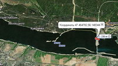
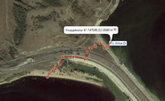
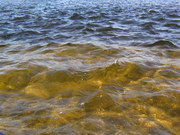

2.700 км гребли за 66 дней с 5 августа по 22 октября 2010 года. Схема обхода 8 из 9 плотин на Волге. 
[Фотографии](media) |
[Дневник](diary) |
<a href="/map/?type=hybrid&amp;center=53.70209,41.31989&amp;zoom=5&amp;kml=kml2010" target="_blank">Трек</a>

## Есть миф, что Волга — река
### На самом деле Волга уже более чем полвека — рукотворные озёра.

Пересёк 8 из 9 плотин (на всех плотинах, кроме первой, есть ГЭС) и увидел все водохранилища. Начал маршрут близко к осени, поэтому застал морозные ночи и сильные ветра в низовьях. Плыл под импровизированным парусом и против ветра, когда волны перекатывались через нос. Дважды плыл круглосуточно. Попал в ночной *речной* шторм и отогревался у рыбацкого костра. Ужинал на борту работающего сухогруза и катался на моторке. За 11 дней прошёл самое большое водохранилище Куйбышевское. Пересекал 30-километровую акваторию. Видел жару, холод и лёд. Забирался в [пещеры](volga2010.048-full.jpg?classes=jpic) в верховьях Волги. Ночевал у местных жителей. Ел [белые грибы](volga2010.079-full.jpg?classes=jpic), судаков и рыбацкую уху. Упрямо ходил в сланцах на босу ногу, даже перебираясь через дамбы, даже при нуле. Больше всего мне понравился кстовский ржаной хлеб, из, наверное, двадцати перепробованных видов.

Протяжённость Волги — 3.530 километров. Проходит через 14 областей России. Река внутреннего стока, не впадает в Мировой океан. Общее падение воды — 256 метров, устье на 28 метров ниже уровня мирового океана.

include 'partials/toc.html.twig'

## Как обходил ГЭС и дамбы, схемы обхода 8 из 9 дамб

На Волге девять плотин, на восьми из них работают ГЭС. Обход всех волжских плотин на байдарке предельно прост — на спутниковой карте ищу самое узкое место дамбы, пытаюсь определить тип причала и выбираю лучший, на месте учитываю ветер и наличие волн. Метод переброски через дамбу — причаливаю, вытаскиваю байдарку, выгружаю вещи, тремя порциями перетаскиваю в границах видимости. Байдарку не сдуваю. На каждый перевал требуется около часа. Надувная байдарка Щука весит всего 7 кг, вес каяка 22-24 кг, однако с каяком можно так же легко перебрасываться через дамбы — только понадобится ещё одна ходка.

### Верхневолжский бейшлот у посёлка Селище

<small>Координаты [56.88589, 33.31734](/map/?target=_blank&type=hybrid&center=56.88589,33.31734&zoom=16&kml=kml2010)</small> 

Самый короткий и простой переход, около 50 метров. Тропа начинается 20 метрах справа от водосбросных ворот. Перед плотиной бакены с надписями «Запретная зона». Причал неудобный на землю и валуны, отчаливание на валуны с сильным течением. Верхневолжский Бейшлот — единственная волжская плотина без ГЭС.

### Иваньковская ГЭС у Дубны, Иваньковское водохранилище

<small>Координаты [56.73643, 37.12089](/map/?type=hybrid&center=56.73643,37.12089&zoom=14&kml=kml2010)</small> 

100 метров перетаскивания. Ориентир — памятник Ленину и ветряки. Нужен самый дальний участок дамбы между ветряками и водосбросными воротами. Удобный причал на мелкую гальку, подъём по булыжникам и стальным кольцам-крепям, через автодорогу, спуск по скользким булыжникам, неудобное отчаливание.

### Угличская ГЭС, Угличское водохранилище

<small>Координаты [57.52624, 38.29874](/map/?type=hybrid&center=57.52624,38.29874&zoom=13&kml=kml2010)</small> 

Переброска через центр дамбы, как можно ближе к спускным воротам, в таком случае будет легче спускаться с противоположной стороны. Путь около сотни метров. Самая неудобная переброска на всей Волге — причал на большие скользкие валуны.

### Рыбинская ГЭС, Плотина у Рыбинска, Рыбинское водохранилище

<small>Координаты [58.09761, 38.70258](/map/?type=hybrid&center=58.09761,38.70258&zoom=15&kml=kml2010)</small> 

Курс на самую правую часть дамбы. Удобное причаливание на песчаную отмель. Весь путь около 450 м. Не стоит пытаться срезать — найдёшь крутые каменистые склоны, поросшие острым кустарником. Сначала по долгой отмели, небольшой подъём, однопутная редко используемая железная дорога, автодорога, спуск по тропинкам, а потом по относительно удобным колотым цепким булыжникам. Спуск на воду из-за острых булыжников небезопасен, но можно пройти ещё около 100 метров вдоль правого берега до окончания каменного склона и спуститься по траве, земле и камышам. Единственная ГЭС на Волге с разнесёнными шлюзами, водосбросными воротами и машинным залом — между соединением основного русла и потока из ГЭС 8 км. Рыбинская ГЭС существенно снижает мощность в выходные, течение пропадает, и вода значительно отходит от берега. Рыбинское водохранилище первое, в котором заметил сильное снижение уровня воды, благодаря этому береговая линия постоянно меняется и не происходит заиливание пляжа.

### Нижегородская ГЭС у Городца, Горьковское водохранилище

<small>Координаты [56.66336, 43.38640](/map/?type=hybrid&center=56.66336,43.38640&zoom=15&kml=kml2010)</small> 

Первая покрытая бетоном плотина. Причал на наклонные бетонные *скользкие* плиты. Трудности с ориентированием с использованием только карты (без навигатора), так как только за пару километров до дамбы из-за горизонта поднимаются строения-маяки на дамбе. Место переброса — часть дамбы длиной всего 500 метров с правой стороны, в километре от сливных ворот. Переваливал при сильном северном ветре, гнавшем волну по всей акватории, на бетонные плиты буквально выбросило, выпрыгнул, поскользнулся, байдарку развернуло и стало бить волнами, только с третьей попытки удалось зацепиться за воздух и вытащиться. Причаливание и отчаливание, если не считать скользкости, в штиль, очень удобные. Городецкая ГЭС тоже снижает мощность в выходные, но не так сильно, как Рыбинская.

### Чебоксарская ГЭС, Чебоксарское водохранилище

<small>Координаты [56.14785, 47.46419](/map/?type=hybrid&center=56.14785,47.46419&zoom=15&kml=kml2010)</small> 

Самая простая плотина. С хорошим фонарём можно проходить ночью. Причал на пляж с круглыми булыжниками (по высокой воде на наклонные бетонные плиты). Примерно на километр левее сливных ворот, ближе к ним не имеет смыла, иначе спускаться через колючие ежевику и облепиху. Много плавника и кусты, надо соблюдать осторожность. Весь переход около 250 метров. После пересечения автодороги, проходящей по гребню дамбы, спуск по тропинкам, немного острых булыжников, отчаливание с песчаной отмели. Внизу, в сотне метров от дамбы, можно заночевать на туристической стоянке.

### Жигулёвская ГЭС, Куйбышевское водохранилище

<small>Координаты [53.44287, 49.49200](/map/?type=hybrid&center=53.44287,49.49200&zoom=15&kml=kml2010)</small> 

Жигулёвская плотина образовывает самое большое в Евразии водохранилище. Заметил постоянное и значительное снижение уровня воды, рядом с Казанью из-за этого образовались 300-метровые отмели, а на середине одной из гигантских акваторий, когда до ближайшего берега было пять километров, выбрался из байдарки, чтобы постоять на твёрдом песчном дне.

Удобное причаливание на наклонные бетонные плиты — целиться на правую часть дамбы, между водосбросными воротами и створами ГЭС, примерно на 500 м левее строений ГЭС. Затем подъём по плитам, парапет, канава, две линии железной дороги, автодорога с парапетом, склон из впритык уложенных булыжников, поросших соснами, грунтовая локальная автодорога, заливной луг, удобное отчаливание с мелкой гальки, смешанной с песком. Весь путь около 350 м. Уровень воды после дамбы постоянно меняется, колебания чувствовались вплоть до начала Саратовского водохранилища, около 50 км. ГЭС работает в постоянном режиме, не снижая мощность в выходные.

### Саратовская ГЭС, Саратовское водохранилище

<small>Координаты [52.06548, 47.75027](/map/?type=hybrid&center=52.06548,47.75027&zoom=15&kml=kml2010)</small> 

Обход с байдаркой Саратовской ГЭС около города Балаково относительно прост. Цель — самая правая часть дамбы, рядом с небольшой водокачкой. По большой воде причал на наклонные бетонные плиты, я же причалил на приятный песчаный пляж. Далее подъём и спуск по маленькой железной лестнице через парапет, линия железной дороги, выхожу к автодороге, пересекаю её и иду направо, до прогала в левом бетонном парапете, где начинается тропинка к песчаному пляжу. Балаковская ГЭС снижает мощность в выходные, скорость течения падает, и вода отходит от берегов.

## Питание

	
Пищу готовил на мультитопливном примусе Primus Omni Fuel. За 66 дней маршрута израсходовал 7 литров бензина и баллон (400 граммов) газа.

Раз в три-четыре дня в продуктовых магазинах недалеко от берега закупал хлеб, крупы, сахар, молочные конфеты, тёмный шоколад, сгущёное молоко и на один привал сыр, творог или сосиски. Овощи, если была такая возможность, просил у местных жителей. В качестве страховочного запаса держал несколько плиток козинака, если не удавалось раздобыть хлеб.

В течение дня пил термосный чёрный чай с сахаром, приготовленный с утра, с ржаным хлебом. Обычно делал два-три перекуса, лишь в редких случаях выгружаясь для этого на берег, чтобы экономить время и не сбивать ритм. Часто проводил в байдарке по десять часов в день без выгрузки на берег.

По вечерам готовил быструю еду — овсянку или макароны, чёрный чай с сахаром и хлебом, в редких случаях запаривал лапшу быстрого приготовления из аварийного запаса. Утром — гречка, горох или рис. В сутки съедал около килограмма хлеба.

## Чистота волжской воды

Первые 30-40 км Верхневолжского водохранилища — прозрачная чистая вода. Ниже вода темнеет и приобретает характерный речной привкус. Наибольшее загрязнение заметил после Нижнего Новгорода и принятия Оки, но уже через 130 км, в протоках разлива Волги и Суры удивился легко просматриваемым дном. Ещё через 200 километров, у Казани, полностью перешёл с ключевой воды на волжскую.

В корме и носу лодки находились две 5-литровые канистры, их с запасом хватало на вечер и утро. До Казани воду набирал из родников, иногда в деревнях, а вот после только из реки (вдали от берега) — родники пропали, а деревни поднялись на высокий берег. Волжская вода после Казани поразила чистотой.

## Ориентирование

Для ориентирования распечатал 110 листов со спутниковыми снимками Волги. Текущий лист лежал в герметичном планшете на носу лодки для быстрого доступа. По вечерам наносил на листы путь, направление ветра, технические отметки, координаты стоянки и дневной пробег. В верховьях пройденный путь считал курвиметром, а когда начались широкие и длинные водохранилища, ставил опорные точки навигатором и складывал расстояния между ними. Прямолинейность маршрута позволяла обходиться пятью точками в день. Спутниковые снимки облегчали ориентирование, практически всегда мог точно определить местонахождение. Сложными были участки — разлив с Сурой и разлив выше Саратова.

## Байдарка Щука

*Я не рекомендую использовать надувные байдарки для плавания по большим акваториям. Для этого лучше всего подходят жёсткие лодки типа «каяк». Единственное оправдание для использования надувных байдарок — небольшой бюджет маршрута.*

Средняя скорость составила 5.5 км/ч, максимальная кратковременная на вёслах 7.5 км/ч (для сравнения, на каяке по ровной воде на вёслах разгоняюсь до 11 км/ч). Без стабилизатора прямолинейного курса или руля использовать байдарку Щука не представляется возможным даже на спокойных акваториях. Все швы байдарки Щука не являются герметичными. При плавании по высокой волне, особенно встречной, достаточно двух часов, чтобы набрать около десяти литров воды. Под дождём байдарка тоже быстро набирает воду. В холодную дождливую или ветреную погоду использовать байдарку можно лишь на небольших переходах. В некоторые дни из-за сильного ветра и волнения байдарке не хватало мореходности для сохранения положительной скорости, в такие дни я вынужденно дневал. Напротив, каяк даже при встречном ветре 5 м/с уверенно держит скорость до 5 км/ч.

## Выброска на берег

Обязательным требованием к выброске был песчаный, либо каменистый причал. Грязные причалы и причаливание при волнении избегал по максимуму, поэтому иногда вставал на ночлег в темноте с фонарём, или весь ходовой день проводил в байдарке. Чалился носом, вылезал, немного подтягивал лодку, брался за хвостовую ручку, поднимал и разворачивал байдарку на 180 градусов. Нос при этом оказывался в 1-2 метрах от воды.

## О течении на Волге глазами плывущего по ней осенью засушливого года

Волга — это цепочка из девяти водохранилищ, течение как таковое присутствует на участках от Верхневолжского до Иваньковского водохранилища 300 км, от Рыбинского до Горьковского около 200 км, 4 участка по 50 км между другими водохранилищами и наиболее быстрый участок — от Волгограда до Каспия 550 км. 2010 год засушливый, ни одна из плотин не работает в режиме постоянного сброса воды, ГЭС снижают мощность на выходные, скорость течения при этом падает почти до нуля. Итого: 1.250 км — русло с течением; 2.250 км — акватории стоячей воды от малых до гигантских размеров.

## Особенности волжских водохранилищ

Волжские водохранилища — это области, где не работают речные законы, здесь может с большой силой дуть ветер, поднимая высокую волну, делая невозможным плавание на надувных гребных лодках. Иногда ветер поднимается ночью, среди дня или резко меняет направление, поэтому дважды в день проверяю прогноз, наблюдаю небо, иногда корректирую курс и так выбираю места стоянок, чтобы ветер не выморозил ночью и не запер волнами утром.

Первые долгие плавания от берега до берега начались на Горьковском водохранилище: 10 километров за два часа. А максимум на Куйбышевском после Ульяновска — 23 км открытой ночной воды за 5 часов.

## Самые долгие отрезки пути

В первый же день маршрута поднялся сильный встречный ветер, стихший только к вечеру, чтобы наверстать время, плыл всю ночь и весь последующий день — 90 километров за 20 часов, две выгрузки на берег. Второй раз — 115 км за 36 часов, тоже только с двумя выгрузками. Остальные дни стандартны — как можно более ранний подъём, световой день в байдарке, ближе к заходу начинаю искать место под лагерь. Первые дни выбирался на берег для перекуса, но позже привык к байдарке и уже не выходил для перекусов на твёрдую почву.

## Болезни

Руки. Допустил ошибку, не меняя хват весла первые сорок дней, в итоге травмировал суставы левой неподвижной кисти, на восстановление ушло около месяца. После этого выучил оба хвата и менял их иногда по несколько раз в день. Это умение оказалось полезным после похолодания, когда смена хвата позволяла разогревать неподвижную руку.

## Особенности экипировки

В трюме две канистры по 5 литров для воды и гермомешок с палаткой, закрученной в пенку, выполняющие роль сиденья. В переднем верхнем грузовом отсеке лодочный насос, гермомешок с одеждой и электроникой, один термос и еда для перекуса, фотоаппарат в гермочехле. В заднем верхнем отсеке гермочехол с едой, спальник, литровая фляга бензина и бензиновый баллон примуса, ботинки в отдельном пакете, два термоса. Поверх заднего отсека 100-литровый рюкзак с водостойкими вещами — ремкомплект, пластиковая фурнитура, верёвки и стропы, хлеб и страховочный запас еды — лапша быстрого приготовления и козинак. Также в верхний рюкзак убирал продукты после закупки, чтобы позже на стоянке разложить по нужным гермомешкам. На самом верху прикреплял маленький рюкзак для самого важного — дневник, навигатор, деньги, паспорт, текущие путевые листы, фонарь и средства гигиены.

## Корабли на Волге

Самое первое на Волге Верхневолжское водохранилище, протяжённостью около 100 км, полностью доступно для катеров и небольших яхт, но отрезано от остальной части реки. Затем идёт русло, на 350 км богатое перекатами и мелями, а потом, в 10 км выше Твери, начинается официальное судоходство и подпор Иваньковского водохранилища. Высота мостовых пролётов здесь 10 метров, встречаю сухогрузы с осадкой до полутора метров и прогулочные двухпалубные корабли.

В следующем, Угличском, третьем по счёту водохранилище, встречаю четырёхпалубный пассажирский корабль, а несколькими днями позже самый большой грузовой корабль — танкер типа «Волгонефть» длиной 130 метров. Кроме этих кораблей, впоследствии встретил множество других — трёх и двухпалубные прогулочные, на подводных крыльях, на воздушной подушке, сухогрузы, баржи и буксиры, паромы, землесосы и землечерпалки, буровые, траулеры, дноуглубительные суда. И множество частных моторок, катеров и гребных лодок, хотя из-за осени их было не очень много.

## О чём же я думал, пока плыл?

Думал о ресурсе байдарки, не ошибся ли с выбором весла, размышлял над тем, что побудило байдарочников разместить лопасти весла в разных плоскостях, когда и где заряжать аккумуляторы, какую еду закупать, что есть утром и что вечером. Думал, что раньше сотрётся — весло или руки? Руки стёрлись раньше. Думал, оторвёт ли стабилизатор на верхневолжских перекатах? Не оторвало. Не сотрутся ли тапочки? Тапочек хватило на всю Волгу и вот уже три месяца хожу в них дома (*заменил стёршиеся тапочки в 2015 году на Оби*). Думал, успею ли до заката доплыть до противоположного берега? Если не успевал, то место под ночёвку искал с помощью фонаря. Зацепит ли меня этот ливень? Этот не зацепил, но сорок других зацепили. Ещё думал о том, что за фал свешивается с кормы почти всех волжских кораблей? Оказалось, это швабры. Думал о рыбаках, о моторках, людях на кораблях, о погоде, о времени и почему же сломался первый фотоаппарат. Думал, думал, думал... И иногда разговаривал сам с собой.

## Искренние благодарности

Водители, вёзшие меня от Осташкова до Волги — на пазике, микроавтобусе и продуктовом грузовике. Владимир Ларионов из Вороново. Продавщица из сельского магазина в Мосеевцах на берегу Стержа, третьего озера на Волге. Москвичи из посёлка Волга. Игорь Панков, его семья и друзья. Тверчане в посёлке Большой Борок. Друзья-туристы на Иваньковском водохранилище напротив Щёлково. Рыбаки на Иваньковской ГЭС. Сторож с лодочной станции у Кимр. Тренер по греко-римской борьбе из Электростали. Галина Алексеевна из деревни Юршино. Андрей из Рыбинска. Александра Ивановна из Красного Бора. Николай и бабушка Анна из дачного посёлка близ Костромы. Евгений Кулик из Маурихи. Моряки на парусном катамаране Мартин. Дальние туристы с острова Большой Татинец. Рыбак-нижегородец Леонид Юрьевич Кротков. Священник с женой и детьми из Троице-Посадского, где Волга сливается с Ветлугой. Нина и Геннадий из деревни Волна. Команда сухогруза Орехово-Зуево. Андрей из Самары. Рыбаки из Новокашпирского под Сызранью. Иван и Ирина из Балаково. Саратовцы на “Прогрессе”. Саратовцы-туристы в протоках разлива. Алексей и Денис строители из Энгельса. Сергей, Алексей, Юрий, Ирина, Алёна, Татьяна Ивановна, Виктор Владимирович — Саратовцы. Галина и Геннадий из Белогорского...

Сторожа с лодочных станций, туристы и рыбаки, снабжавшие бензином для примуса. Позитивные люди, поддерживавшие добрым разговором, те, кто махал с берега или просто провожал взглядом... Капитаны кораблей, отдававшие гудки...

Машинист пассажирского тепловоза везёт свой поезд дальнего следования в нескольких десятках метрах от меня на крутом каменном берегу, а я приветственно машу в сторону кабины, знаю, что он заметил меня. И в ответ слышу двойной гудок. Наша жизнь — дорога.

 

> Копия рассказа о Волжском плавании [размещена](strana_ru_routes_2297111.png) на проекте Strana.ru.

> Один из отзывов — [penelopa-kruz.livejournal.com/48408.html](http://penelopa-kruz.livejournal.com/48408.html) ([png-копия](penelopa-kruz_livejournal_com_48408_html.png)).

> Друзья-единомышленники Виктор и Марат из Германии в 2013 году прошли часть Волги на парусной байдарке — [downthevolga.shutterfly.com](https://downthevolga.shutterfly.com) ([pdf-копия](viktor-and-marat-down-the-volga-in-a-kayak_copy.pdf)).

> В 2014 году австралиец Марк Калч (Mark Kalch) прошёл по Волге от истока до устья за 71 день. Марк прошёл Волгу в рамках своего проекта «7 рек, 7 континентов» [7rivers7continents.com](http://7rivers7continents.com).