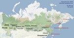
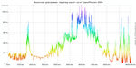
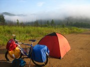
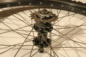
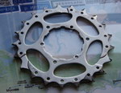
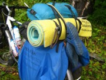
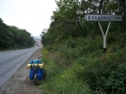
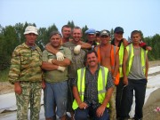
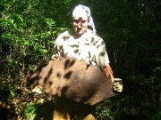

ТрансРоссия Москва&ndash;Владивосток на велосипеде: 10.300&nbsp;км за 118&nbsp;дней. С 17&nbsp;мая по 11&nbsp;сентября 2008. 
[Фотографии](media) |
[Дневник](diary) |
<a href="/map/?type=hybrid&amp;center=50.17195,87.17019&amp;zoom=4&amp;kml=kml2008" target="_blank">Трек</a>

## С этого всё началось

*Написано спустя 6 лет:* «Сейчас воспринимаю этот маршрут как лёгкий. Единственное, что требуется — грамотно подойти к технической части и никогда не лениться. Проблемы, такие как холод, голод и одиночество здесь не встретятся. Выехав на трассу с бешеным трафиком на протяжении практически всех 10 тысяч километров, вклиниваешься в общий ритм и подгоняешься им до самого Владивостока. Через каждые 30 километров кафе с едой, электричеством, интернетом и общением, указатели вдоль всего пути, мосты через все реки. Единственная сложность в необходимости иметь хладнокровное отношение к автомобилям, пролетающим в трёх десятках сантиметров от моего левого плеча. Самое интересное в природе, в людях и новое в себе начнёт открываться лишь за Байкалом, когда за спиной будет два месяца и больше пяти тысяч километров».

## Мечта, которая сбылась

Началось так: бабушка принесла книгу 1986 года с фотографиями Дальнего Востока, я показал ей особо [понравившуюся](transrussia-2008-from-book.jpg?classes=jpic): «Внучёк, это же так далеко! Никто из нас не был на Дальнем Востоке, и ты, скорее всего, тоже там не окажешься». У меня даже слёзы навернулись, потому что уже тогда знал, что люди могут гораздо больше, чем думают о себе.

Москва — Урал — Новосибирск — Обь — Енисей — Байкал — Чита — Амур — Хабаровск — Японское море — Владивосток.

Кажется, прошло два или три года после случая с книгой, плюс четыре месяца в седле, и вот я уже [вживую](tr08.20.japon-sea-vladivostok.49.jpg?classes=jpic) наблюдаю ту самую фотографию.

## Потребовался месяц для подготовки экипировки, и 7 лет для подготовки мозга

Когда выезжал из родного Фрязино, был твёрдо уверен в успехе, но не мог представить многие участки маршрута, Дальний Восток казался самым загадочным.

Как и во всех путешествиях, первый месяц самый сложный, пока пройденный путь не становится поддержкой.

Первый взятый этап — Урал, потом пересёк Западно-Сибирскую равнину, плоскую как аэродром. Небольшие участки горной дороги между Красноярском и Иркутском показали, как может выглядеть трасса Амур. Хорошо выкладывался на горах вокруг Байкала, отметив, что это один из наиболее перевальных участков, но на этот раз он дался легче, чем в новогодний тридцатиградусный мороз три года назад.

Кстати, это было одно из поражений. Отъезжая тогда от Байкала на поезде, смотря на него из окна, не догадывался, что спустя три года буду проезжать мимо на велосипеде, воспринимая достижение моря-озера лишь как маленький этап большого пути.

## Велосипед с одной передачей

Экспериментом была одна передача, я хотел выяснить, можно ли путешествовать на односкоростном велосипеде? Одна — мало, три — достаточно. Одна задняя звезда позволяет при износе цепи менять только её, не устанавливать новую кассету, для такой замены не нужен инструмент. Цепями можно запастись на всю дорогу, они не займут много места. Ресурс цепи — около 3.000 километров.

Установил звёзды 21 и 42. Итог: в первую половину пути, за 61 день проехал 6500 километров, но в некоторые многокилометровые подъёмы заходил пешком. В Чите поставил тройную переднюю звезду и начал делать самые крутые горки. Даже гравий летел из-под колёс.

## О страхе убить колени

Во время ТрансРоссии первые две недели отказывала то одна нога, то другая, настолько сильными были боли в коленях. Запись в дневнике: «Еду на одном цилиндре». По прошествии двух недель колени разработались, боли прекратились и больше не появлялись, хотя нагрузки бывали гораздо большими.

## Горные перевалы, или «час пота за пять минут счастья»

Всё, что меньше двух километров — просто подъём и ни в какие дневники не попадает.

Только один, Ксеньевский, между амурской трассой и старой дорогой, запомнился крутизной, взял его частично пешком, даже несмотря на передачу 1:1. Если начинаю перевал, допускаю лишь полуминутный отдых, больший отдых заставит заново врабатываться. Передача 1:1, стоя, со скоростью 4-5 км/ч. Максимальная длина подъёма 14 км, обычная 5 км. Спуски — это компенсация за подъём, «час пота за пять минут счастья». Максимальная скорость на спуске 67 км/ч.

## Питание

Питался в дорожных кафе, в них же заряжал аккумуляторы для фотоаппарата и коммуникатора. Максимальное расстояние между столовыми 60 км, на трассе Амур до сотни. Полностью перешёл на автономное питание после Хабаровска, когда свернул с трассы в горы Сихотэ-Алинь.

## Более всего запомнилось

Месяц в перевалах Сихотэ-Алиня и две тысячи километров пыльной строящейся трассы Чита-Хабаровск.

## Лучшие друзья — водители-дальнобойщики

Потому что у нас примерно одинаково организована душа, и наши жизни связаны с Дорогой.

## Радость на финише

В этот момент я почувствовал, что маршрут в кармане, ничто уже не помешает доехать до финиша — когда завершал трассу Амур и подъезжал к Хабаровску. Я плакал от счастья, как плачут Олимпийские чемпионы, занявшие первое место. Их от победы отделяли годы тренировок, я же выстлал свой путь цепочкой поражений, постепенно делавших меня сильнее.

_Запись в дневнике: Сегодня, в 20:07 ВПЕРВЫЕ увидел Японское море. 28 августа, 9.600 км от Фрязино, 103-й день, вошёл в воды Японского моря и стоял, обдаваемый высокими волнами. Ботинки набрались песком и камешками. Стоял и мечтал. И радовался._

## Кратко

Велосипед не ломался, только стачивались покрышки и изнашивались цепи. Спал всегда в палатке, за исключением 5 ночей в гостиницах. Питался в кафе и столовых, кроме этого у меня была походная кухня на бензине и газе. Электронику заряжал там же, где и ел. Я провёл три ночи в частных домах, напрашиваясь на ночлег. Труднее всего было проезжать через крупные города. У меня было около 20 килограммов груза на переднем и заднем багажниках.

Около Красноярска отравился и два дня пролежал в больнице. Среднее расстояние между столовыми (пунктами питания) около 50 км. 

Около двадцати раз водители предлагали подвезти, но я всегда отказывался.

Дальний Восток — это край нашей страны, почти ненаселённый, с особенной, другой природой, другим рельефом, более сильными людьми, иным климатом. По дороге я расспрашивал — «Какой он, Дальний Восток?» Никто не мог толком объяснить, а он вроде и такой же, но и совершенно другой.

## Строительство крупнейшей автотрассы

Трасса Амур Чита-Хабаровск настолько новая, что не везде смог отрисовать трек — на некоторых космоснимках вместо дороги [девственная тайга](amur-road-satellite-image.jpg?classes=jpic).

## Россия

Сибирь не холодна, Чита солнечный город, а Дальний Восток совсем не дальний, раз до него можно добраться только ногами.